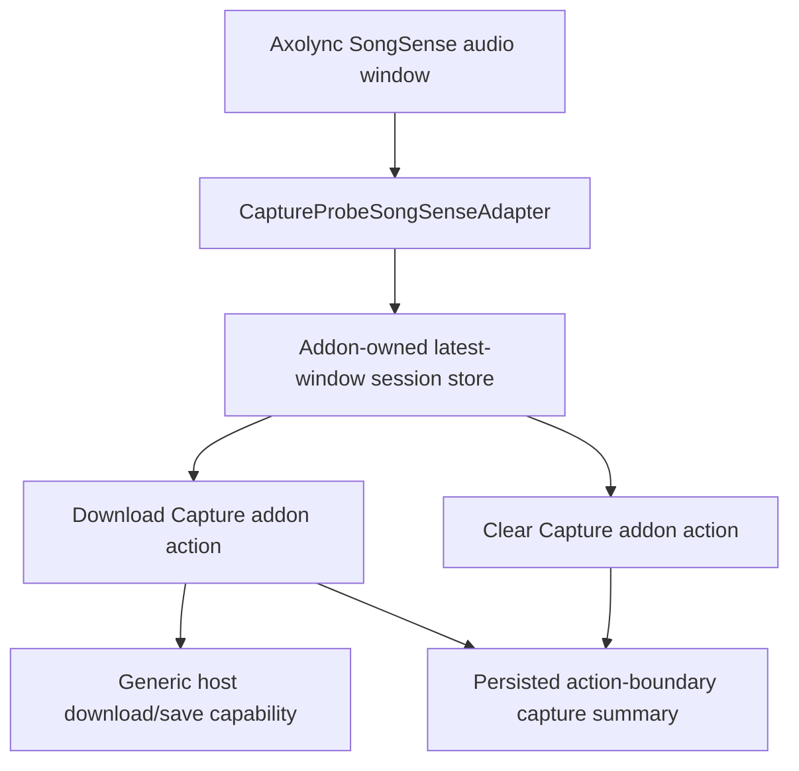

# Design Document

## Overview

`axolync-addon-songsense-capture-probe` is a diagnostic Stage 1 addon whose job is to answer one concrete debugging question:

- is the audio that Axolync delivers to a SongSense addon itself good enough to be tested outside Axolync?

The addon deliberately does not attempt recognition. Instead, it:

- consumes the normal SongSense query payload
- retains the latest authoritative SongSense host window in session memory
- exposes a lightweight addon-global capture summary
- offers addon actions to download or clear the current capture

This design keeps the first implementation narrow and truthful:

- one local-js SongSense adapter
- one explicit hosted-web session capture store
- one deterministic export format
- generic addon action ownership for active operations
- explicit browser-host follow-on for addon-driven file download
- no promise of live query-time runtime-surface mutation

## Architecture

### High-Level Flow



### Design Decisions

1. Keep the probe recognition-free.
   - The adapter always returns `[]`.
   - This addon exists to capture and export audio truth, not to rank candidates.

2. Keep the retained capture equal to the latest honest host window.
   - The current browser host delivers rolling SongSense windows, not append-only delta chunks.
   - The probe should therefore replace the retained capture with the newest authoritative host window instead of blindly appending overlapping audio.

3. Keep raw bytes session-scoped first, but make the sharing mechanism explicit.
   - The first implementation should use an addon-owned symbol-keyed `globalThis` session store shared by the adapter and action handlers.
   - This relies on the current hosted-web Stage 1 behavior where both query modules and addon action modules execute in the same JS realm.
   - The addon must scope that support truthfully rather than implying this works on every future host.

4. Keep summary truth lightweight and semantic.
   - The addon-global runtime surface exposes only metadata such as duration, sample rate, channels, and chunk count.
   - Raw bytes remain outside the normal UI.
   - Because the current query-time host seam cannot mutate addon-local runtime state, the visible summary should refresh on addon action boundaries only.

5. Use a standard export format optimized for manual tooling.
   - The first export format should be WAV PCM16.
   - That format is simple, deterministic, widely playable, and easier to test outside Axolync than a custom raw dump.

6. Treat download as a real host seam.
   - The addon should not import browser code to trigger a save.
   - The browser host should expose a generic addon action download/save capability through the documented action seam.

## Components and Interfaces

### 1. `CaptureProbeSongSenseAdapter`

Responsibilities:

- validate incoming SongSense audio payloads
- compare incoming audio-time metadata to the currently retained host window
- replace the retained capture only when the incoming host window is newer
- suppress stale or non-advancing windows
- emit structured capture diagnostics
- always return zero candidates

Non-responsibilities:

- song recognition
- fingerprinting
- lookup/proxy calls
- persistence of large binary data into primitive settings

Expected query input remains the current Stage 1 SongSense contract:

```ts
interface CaptureProbeQueryInput {
  audioPayload?: {
    audioBuffer?: Float32Array;
    sampleRateHz?: number;
    channels?: number;
  };
  chunkMeta?: {
    bufferStartAudioMs?: number;
    captureEndAudioMs?: number;
    durationMs?: number;
    receivedPerfMs?: number;
  };
  __stage1AddonContext?: {
    addonId: string;
    addonVersion: string;
    emitDebugLog?: (entry: { level?: string; message?: string; payload?: unknown }) => void;
  };
}
```

### 2. `runtime/captureSessionStore`

Introduce one addon-owned shared module that holds the latest retained capture state on `globalThis`, keyed by addon id and version through a symbol-backed registry.

Why this choice for the first implementation:

- it keeps raw bytes out of primitive settings
- it does not require a new query-time persistence seam from browser immediately
- it gives both the adapter and addon actions one explicit addon-owned session store without importing browser internals or relying on accidental module-singleton sharing
- it matches the current hosted-web Stage 1 realm model honestly

Stored shape:

```ts
interface CaptureSessionState {
  sampleRateHz: number;
  channels: number;
  chunkCount: number;
  totalSampleCount: number;
  captureEndAudioMs: number | null;
  bufferStartAudioMs: number | null;
  updatedAtIso: string | null;
  audioBuffer: Float32Array;
}
```

Policy:

- keep the most recent authoritative host window only
- reject stale or non-advancing windows by comparing `captureEndAudioMs`
- reset explicitly if incompatible sample rate or channel shape appears
- log replacement, suppression, and reset decisions

### 3. `runtime/captureSummary`

This helper maps session store state into the lightweight persisted summary snapshot used by the runtime surface.

Surface content should include:

- `hasCapture`
- `durationMs`
- `sampleRateHz`
- `channels`
- `chunkCount`
- `updatedAtIso`

The runtime surface should expose these as semantic facts or a single informational item, not as raw bytes or executable UI hints.

Because query-time runtime does not currently own addon-local state mutation hooks, the persisted summary should be written by addon actions after they inspect or clear the session store.

### 4. `runtime/wavExport`

Add one addon-local exporter that converts the current `Float32Array` capture into a standard WAV PCM16 file.

Why WAV PCM16 first:

- broad external compatibility
- straightforward deterministic encoding
- manual playback and external Shazam-style verification are easier

Interface:

```ts
interface EncodedCaptureFile {
  fileName: string;
  mimeType: 'audio/wav';
  bytes: Uint8Array;
  durationMs: number;
  sampleRateHz: number;
  channels: number;
}
```

### 5. `actions/downloadCaptureAction`

Responsibilities:

- read the current session capture
- fail explicitly when no capture exists
- encode the capture as WAV PCM16
- ask the host to save/download the file through a generic addon action capability
- persist a fresh action-boundary summary snapshot after the action inspects the current capture
- report structured progress or completion details

The intended host seam addition is:

```ts
interface AddonActionContext {
  saveBytesAsDownload(
    fileName: string,
    mimeType: string,
    bytes: Uint8Array,
  ): Promise<{ uri?: string | null } | null>;
}
```

If the browser-side host capability is unavailable, the action must fail with an explicit operator-visible reason.

### 6. `actions/clearCaptureAction`

Responsibilities:

- clear the current session capture from the addon-owned store
- persist an empty action-boundary summary snapshot
- emit a structured diagnostic outcome
- refresh the runtime-surface summary back to empty

### 7. Addon Metadata

The addon should declare:

- one SongSense adapter
- two addon actions:
  - `download_capture`
  - `clear_capture`
- one addon runtime data surface for capture summary

It should remain explicit that:

- this is a diagnostic addon
- it intentionally never detects songs
- the useful artifact is the exported capture, not a recognition result

## Data Models

### Bounded Session Capture

```ts
interface BoundedCaptureState {
  sampleRateHz: number;
  channels: number;
  audioBuffer: Float32Array;
  chunkCount: number;
  captureEndAudioMs: number | null;
  bufferStartAudioMs: number | null;
  updatedAtIso: string | null;
}
```

### Runtime Surface Summary

```ts
interface CaptureSummaryView {
  hasCapture: boolean;
  durationMs: number;
  sampleRateHz: number | null;
  channels: number | null;
  chunkCount: number;
  updatedAtIso: string | null;
  captureEndAudioMs: number | null;
  summaryFreshness: 'action-boundary';
}
```

### Download Action Input and Outcome

```ts
interface DownloadCaptureActionInput {}

interface DownloadCaptureActionOutcome {
  status: 'downloaded' | 'no-capture';
  fileName?: string;
  mimeType?: string;
  durationMs?: number;
}
```

## Error Handling

### Query-Time Errors

- Missing or unusable audio payload:
  - log a structured skip event
  - do not mutate capture
  - return `[]`

- Sample-rate or channel mismatch against existing session capture:
  - reset the session capture explicitly
  - log the reset reason
  - replace the retained capture with the new authoritative host window

- Older or non-advancing host window:
  - keep the prior retained capture
  - log the stale-window suppression reason

### Download Errors

- No capture exists:
  - return an explicit no-capture outcome
  - do not create an empty file

- Host download/save capability missing:
  - fail truthfully with a clear operator-visible message

- WAV encoding failure:
  - log and surface the encoding error

### Clear Errors

- If clear is requested with no capture:
  - complete idempotently with an empty-state outcome

## Testing Strategy

### Addon Repo Tests

1. Unit-test the bounded capture store.
   - replace-with-newer-window
   - suppress-stale-window
   - incompatible-shape reset
   - clear

2. Unit-test WAV export.
   - deterministic RIFF/WAVE header
   - sample count and duration correctness
   - PCM16 conversion behavior

3. Unit-test the adapter.
   - usable newer audio replaces capture
   - stale audio does not replace capture
   - missing audio returns `[]`
   - probe never emits candidates
   - structured diagnostics fire

4. Unit-test action handlers.
   - `download_capture` with capture
   - `download_capture` without capture
   - `clear_capture`
   - missing host download capability

### Browser Host Tests

1. Extend the generic addon action runner tests for a host download/save capability.
2. Add a browser integration proof that running `Download Capture` from the packaged addon triggers the generic download/save path.
3. Add a runtime-surface proof that capture summary refreshes after download and clear actions, and does not promise immediate query-time live updates without a broader host seam.

### Manual Verification

1. Install the packaged probe addon in Axolync.
2. Select it as the active SongSense addon.
3. Let it capture a known real song.
4. Run `Download Capture`.
5. Play or transfer the exported WAV and verify that an external tool such as Shazam on Android can evaluate it.

That manual path is the key product value of this addon: it helps isolate whether the host-delivered audio is itself legitimate before blaming downstream recognizers.
